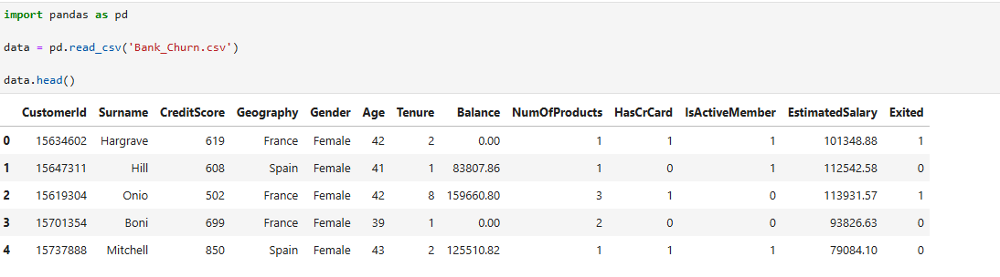

# 🔍 **Customer Segmentation Analysis**

## 📝 **Project Overview**  
As a **Data Scientist** at the **Bank of Mavenland**, I was tasked with segmenting the bank's current customers.
The goal was to **identify distinct customer groups** and recommend tailored **products or services** for each segment based on data analysis and clustering techniques.

## 🎯 **The Assignment**  
The product team aimed to better understand their customer base and deliver solutions that cater to different segments.  
- **Objective**: Segment the bank's current customers using clustering methods.  
- **Outcome**: Provide recommendations for potential new products or services tailored to each segment.

## 🚀 **Project Objectives**  
1. **Prepare the data**  
2. **Cluster the customers (Round 1)**  
3. **Cluster the customers (Round 2)**  
4. **Explore the clusters and make recommendations**  

## 🛠️ **Technologies Used**  
- **Python**  
- **Pandas**  
- **Scikit-Learn**  
- **Matplotlib / Seaborn**  
- **Jupyter Notebook**  

## 📈 **Results**  
The project successfully segmented customers into distinct clusters, allowing the bank to make **data-driven decisions**.
Tailored recommendations for new products and services were provided for each segment to enhance customer satisfaction and drive business growth.

## 🚀 **Objective 1: Prepare the Data for Modeling**  
The first objective is to prepare the data for modeling by:  
- Selecting a subset of fields.  
- Ensuring all fields are numeric.  
- Exploring distributions of the selected features.  
- Engineering a new feature to enhance segmentation quality.

Read the "Bank_Churn.csv" file and preview the top 5 rows
1. **Read the "Bank_Churn.csv" file** and  **preview the top 5 rows**.
   
