# 🔍 **Customer Segmentation Analysis**

## 📝 **Project Overview**  
As a **Data Scientist** at the **Bank of Mavenland**, I was tasked with segmenting the bank's current customers.
The goal was to **identify distinct customer groups** and recommend tailored **products or services** for each segment based on data analysis and clustering techniques.

## 🎯 **The Assignment**  
The product team aimed to better understand their customer base and deliver solutions that cater to different segments.  
- **Objective**: Segment the bank's current customers using clustering methods.  
- **Outcome**: Provide recommendations for potential new products or services tailored to each segment.

## 🚀 **Project Objectives**  
1. **Prepare the data**  
2. **Cluster the customers (Round 1)**  
3. **Cluster the customers (Round 2)**  
4. **Explore the clusters and make recommendations**  

## 🛠️ **Technologies Used**  
- **Python**  
- **Pandas**  
- **Scikit-Learn**  
- **Matplotlib / Seaborn**  
- **Jupyter Notebook**  

## 📈 **Results**  
The project successfully segmented customers into distinct clusters, allowing the bank to make **data-driven decisions**.
Tailored recommendations for new products and services were provided for each segment to enhance customer satisfaction and drive business growth.

## 🚀 **Objective 1: Prepare the Data for Modeling**  
The first objective is to prepare the data for modeling by:  

1. **Read and Preview the Data**  
   - Load the **`Bank_Churn.csv`** file.  
   - Preview the **top 5 rows** to understand the structure of the dataset.
   

2. **Create a DataFrame**  
   - Include all fields except **`CustomerId`**, **`Surname`**, and **`Exited`**.
       

3. **Make All Text Fields Numeric**  
   - Convert categorical or text-based fields into numerical format using techniques such as **label encoding** or **one-hot encoding**.
     
     
4. **Explore the Data**  
   - Analyze the data by examining:  
     - Minimum and maximum values of each column.  
       
     - The distribution of numerical features.
       

5. **Engineer a New Feature**  
   - Create a new feature called **`ProductsPerYear`**:  
      

## 🚀 **Objective 2: Cluster the Customers (Round 1)**  
The second objective is to segment customers using **K-Means clustering**. The steps include:

1. **Standardize the Data**  
   - Scale the data so that each column has a **mean of 0** and a **standard deviation of 1**.  
     
2. **Create an Inertia Plot**  
   - Fit **K-Means clustering models** on the standardized data for **2 to 15 clusters**.
      
   - Plot the inertia values to identify the optimal number of clusters using the **elbow method**.
     

3. **Fit the Optimal K-Means Model**  
   - Determine the elbow point from the inertia plot and use that value of **k** to fit the K-Means model.
      

4. **Analyze the Clusters**  
   - Check the **number of customers** in each cluster to understand the cluster distribution.
       

5. **Interpret the Clusters**  
   - Create a **heat map** of cluster centers to visualize feature values for each cluster.
      
   - Analyze and interpret the characteristics of the clusters.
     
     
## 🚀 **Objective 3: Cluster the Customers (Round 2)**  
The third objective is to perform **K-Means clustering** using a different subset of fields and compare the results to the initial clustering.

1. **Analyze Summary Statistics**  
   - Review the **summary statistics** by country.
     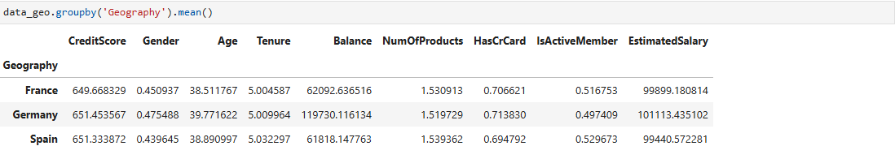  
   - Exclude the **country fields** from the dataset.
     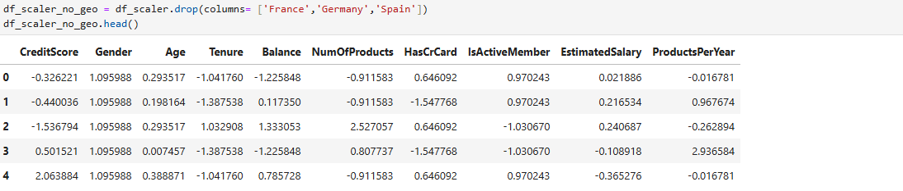   

2. **Create an Inertia Plot**  
   - Fit **K-Means clustering models** on the standardized data (without country fields) for **2 to 15 clusters**.
     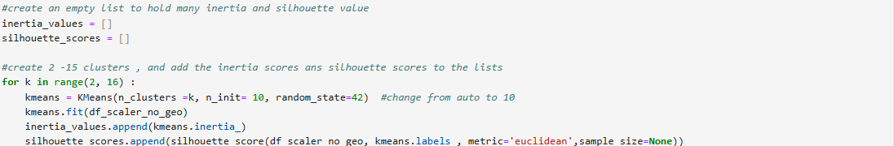  
   - Plot the inertia values and identify the **elbow point** to determine the optimal number of clusters.
     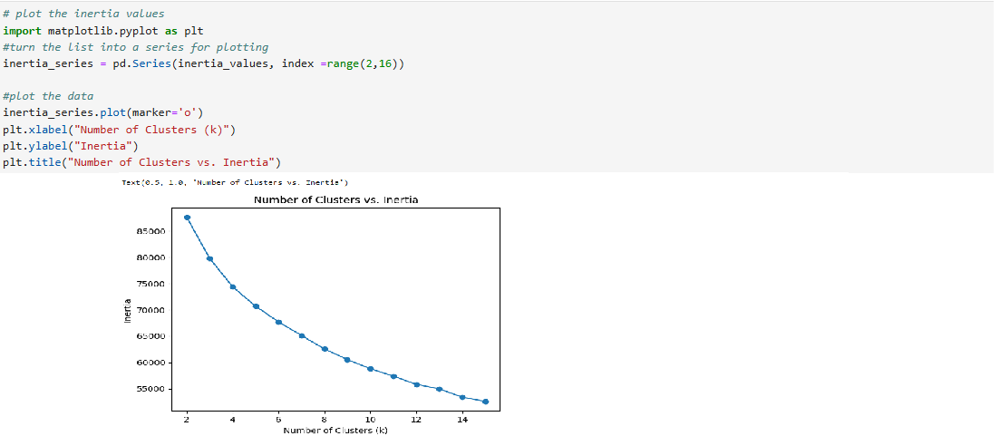 

3. **Fit the Optimal K-Means Model**  
   - Use the identified elbow point value of **k** to fit the K-Means model.
     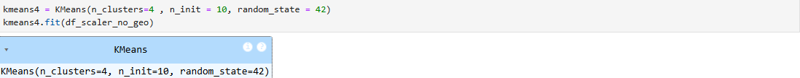   

4. **Analyze the Clusters**  
   - Check the **number of customers** in each cluster to understand the cluster distribution.
     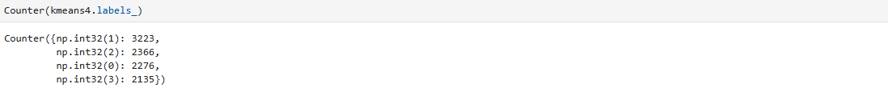  

5. **Interpret the Clusters**  
   - Create a **heat map** of cluster centers to visualize feature values for each cluster.
     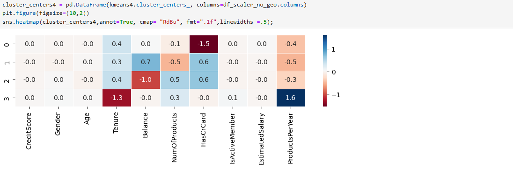   
   - Analyze and interpret the differences compared to the first clustering results.
     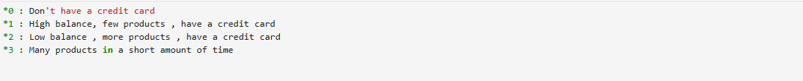

## 🚀 **Objective 4: Explore the Clusters and Make Recommendations**  
The final objective is to analyze the **K-Means clusters** further by examining their churn rates and country breakdowns, and then provide recommendations to cater to each segment.

1. **Combine Data and Cluster Labels**  
   - Create a **DataFrame** that combines:  
     - The dataset from the end of **Objective 1**.  
     - The **"Exited"** field (indicating churn).  
     - The **cluster labels** from the K-Means model.
       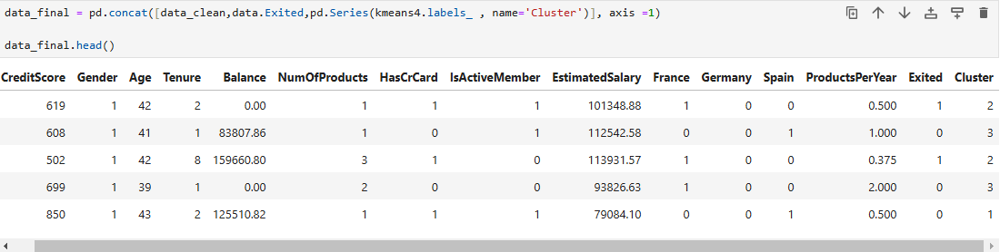
2. **Analyze Churn Rate**  
   - Calculate and view the **churn rate** (percentage of customers who "Exited") for each cluster.
     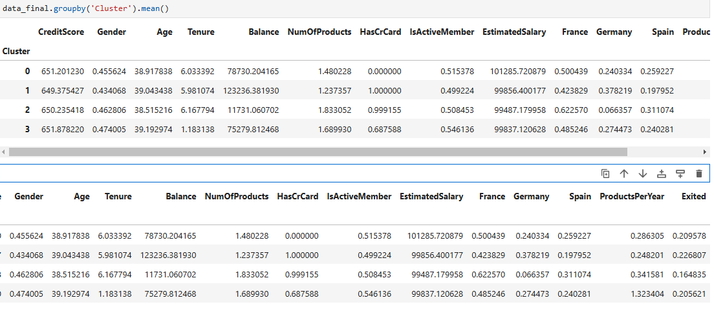
3. **Explore Country Breakdown**  
   - View the **country distribution** within each cluster to identify regional patterns.
4. **Make Recommendations**  
   - Based on the churn rate and country breakdown:  
     - Provide actionable **recommendations** to cater to each customer segment.
       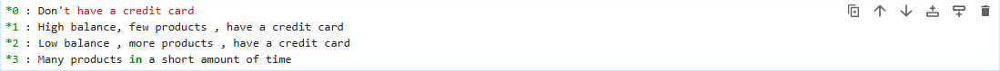 
     - Suggest strategies to reduce churn and improve customer retention.
       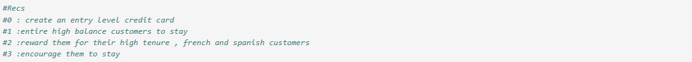

